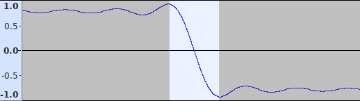
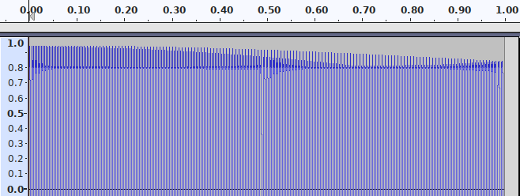
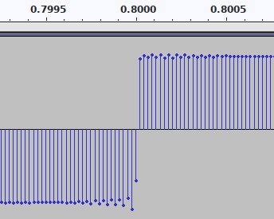

== Compact Disc Temporal Resolution

Compact Disc Digital Audio (CDDA) comprises two channels of 16-bit PCM
with sampling-rate 44100 Hz—i.e. with sampling-period ≅22.7
microseconds.
http://boson.physics.sc.edu/~kunchur/Acoustics-papers.htm[Some have
suggested] that _‘humans can discern timing alterations on a 5
microsecond time scale, indicating that the digital sampling rates
used in common consumer audio (such as CD) are insufficient for fully
preserving transparency.’_ In this document however, we show that CDDA
can preserve timing accuracy to a far greater degree than its
sampling-period.

=== Temporal Resolution

Consider a PCM recording ‘A’ of audio events i.e. particular sounds or
waveforms that are identifiable (by some means) as occurring at
specific sampling-points counted from the beginning of the recording,
and let the sampling-rate of A exceed that of CDDA.

If A were ‘down-converted’ to CDDA, then ‘up-converted’ back to the
original sampling-rate, then the result ‘B’ would be subject to all of
CDDA’s limitations.  If the audio events in B still occur at precisely
the same points as in A, then the sampling-period of A would serve as an upper
bound for CDDA’s _temporal resolution_ of the tested audio.

=== Test Method

The above procedure can be simulated with a computer, for a single
channel, as follows.

* File A shall be a synthesised, ideal square-wave, sampled at 1 GHz;
identifiable audio events are the square-wave transitions, occurring
between samples one nanosecond apart.  The square-wave’s frequency ‘F’
shall be 150·44100/44100.5 ≅ 149.9983 Hz; its duration shall be one
second.  Sample encoding shall be signed 8-bit, i.e. the positive and
negative portions of the square-wave shall be represented by the
values ±127.

* Down-converting A to CDDA will yield intermediate file
T, with one 16-bit sample for every ≅22676 samples from A.  F has been
chosen such that in T, the time between each audio event and its
nearest CDDA sampling-point gradually increases from zero to half the
sampling-period (i.e. the events fall, at differing positions, between
CDDA sampling-points).

* Up-converting file T back to 1 GHz will give file B (encoded per file
A).  Due to the band-limiting inherent in the conversion process, the
square-wave transitions in B will no longer occur between consecutive
samples but over a large number of samples in excess of twice the
ratio of sampling-rates—see Figure 1.

+
.Duration of transitions in B is > 47000 samples

* The simplest means to determine the occurrence time of a transition
in B is to use its zero-crossing point; this can be realised using
amplification and saturation to map B back to a square wave.
Consequently, to compare the times of events in A and B, file
comparison will suffice; i.e. if the files are equal then the event
times are equal.

=== Test Procedure

The above method can be implemented as follows:

.On Ubuntu OS
****
Open a command-prompt window and enter the following commands:

----
sudo apt install sox
cd /tmp
sox --ver

sox -D -r1e9 -n a.s8 synth 1 sq 149.9983
sox -D -r1e9 -c1 a.s8 -b16 t.wav vol .8 rate 44100
sox -DV1 t.wav b.s8 rate 1e9 vol 1e9 vol .99

cmp [ab].s8
----
****

==== Notes

* The first invocation of the ‘sox’ utility displays its version
number, which should be ‘SoX v14.4.2’.

* On a typical desktop or laptop computer, the group of three ‘sox’
commands takes a minute or two to complete; approximately 2 Gbytes of
disc space will be consumed in the process.

=== Results Analysis

The comparison made by the last command in the test finds files A and
B to be identical (Ubuntu OS: nothing is reported), indicating that
the timing of audio events in A has been reproduced from a CDDA
encoded version of A.

To help ensure the validity of the test procedure, file t.wav can be
inspected using a D.A.W.  As shown in Figures 2 & 3, the intermediate
signal is as expected:

.Intermediate signal, positive portion

.Intermediate signal, one transition

=== Further Tests

. An attempt to modify the test to use a sampling-rate of 2 GHz
failed, apparently due to limitations of the ‘sox’ utility.

. Modified to use a square-wave with ½ amplitude, the test still
passes; with ¼ amplitude, it fails.

=== Conclusion

Experimentation has shown that CDDA encoding can accurately reproduce
the timing of audio events to within one nanosecond, providing that
the events have large-enough amplitude.
